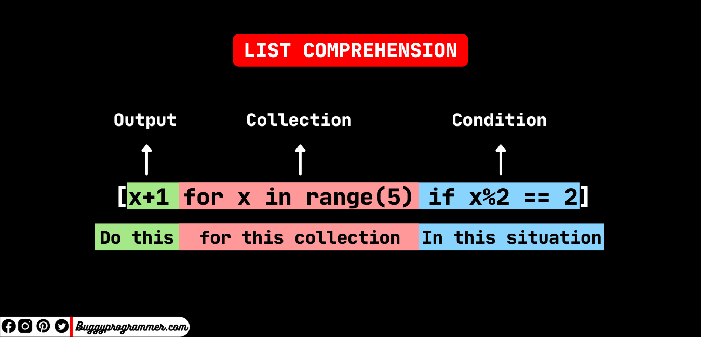

# Post-Flight Analysis Training

## Part 0: Getting Started

Post-flight analysis is a key part of the iterative engineering process. Looking back at the data collected during a test flight can provide insights into the forces experienced on the rocket, the general flight path, the specific timings of staging events, and more. The insights, in turn, allow other groups within our team to improve their designs to build a better rocket.

### 0.1: What is Python?

Python is one of the most widely-used programming languages in the computer engineering and computer science industry, and for good reason; it has a very simple syntax that beginners can read and understand, is very easy to develop and test code with, and has built-in support for many powerful packages that assist the development process greatly. It’s especially useful for post-flight data analysis, in which case Python is able to provide powerful data visualization tools (like graphs and charts), as well as interactive interfaces and automation services to make interacting and analyzing our data even easier. By taking advantage of these features of Python, post-flight data analysis can be made far simpler and efficient.


#### Compiled vs. Interpreted Languages


Python is an interpreted programming language, just like Javascript and R. “Interpreted” means that when you run your code, your program is evaluated and executed line by line, every single time you run the program. This isn’t always the case; certain programming languages, like C, C++, and Rust, are called compiled languages. Compiled languages are translated (or compiled) into a more computer-friendly format the first time they’re run, and this new version is used every time the program is run.


A compiled language, over time, will be faster than an interpreted one; after all, it’s easier and faster for a computer to understand its own language than to have everything translated line-by-line. Additionally, more errors will be caught at compile time as opposed to runtime, meaning some mistakes are caught earlier. However, if you make a lot of changes to the code, and the language needs to constantly re-translate (or re-compile) the entire program every time a change is made, this can become a huge time-waster for a programmer. This makes an interpreted language like Python perfect for testing and development.


This is how a compiled language behaves, in general:


And similarly, this is how an interpreted language behaves.


#### Packages and Modules

Using packages, you can incorporate Python code written by others into your own program. These packages, oftentimes, are downloaded off the internet to your machine and stored locally so your code can pull from them. Packages are simply groups of “modules,” where each module is a Python file with useful routines written into them that can be pulled into your main program. When you incorporate a module or a package into your program, they become “dependencies.” As the name implies, a Python program needs all of its dependencies at runtime in order to function correctly, or oftentimes, function at all. Sometimes modules include packages or modules within themselves; in this case, you still need to find and download these modules for your program to function. This means that dependencies can have dependencies as well!


#### Installing Packages (pip)


PIP is one of the most common tools for package management in Python. With one-line terminal commands, packages can be downloaded to your machine, meaning the only thing you need to do is import the code into your file. However, some projects may require certain packages while others require different packages; in this case, installing all the packages for every project you’ll work on is messy and a waste of resources. A simple solution is venv, a “virtual environment” creator for Python, which essentially allows you to create a separate space for different projects and sets of packages. This means multiple package and module installations won’t clutter up and pollute your build environment, whatever it may be for that project.


Pip, however, has no built-in support for packages and modules written outside of the standard Python libraries, and also has no built-in isolated build environment support; it relies on outside tools like Venv to achieve this. This means that although using PIP will work for some time, it is good to pursue other package management tools that have more dynamic packages and build environment support, such as Conda.


### 0.2: What is Conda?

Conda is an open-source package management and environment management system. This tool installs, runs, and updates software packages and dependencies. Conda and pip can be used to install packages and dependencies but conda is preferred because it allows the users to create virtual environments for different projects while being more efficient and easy to use.

#### Managing Multiple Environments

As stated above conda allows the user to create different virtual environments. A virtual environment is an isolated space where you can install and manage a specific set of packages and dependencies without affecting other projects on your system. Each environment has its directory, separate from the system's global environment, containing all the necessary files and libraries required for a particular project. This isolation helps prevent conflicts between different projects, allowing you to use different versions of packages and Python for each project. Environments are especially useful for managing dependencies and ensuring that your projects are reproducible and consistent across different systems. Conda allows you to switch between these different environments and install different versions of Python or packages in different environments efficiently and easily.


#### Controling Dependencies and Conflicts

It is important to have the ability to control the version of dependencies installed for your project because of how different packages when used together rely on others. A good visualization for this is called a dependency graph which can be seen below. A dependency graph is a visual representation of the relationships between software packages and their dependencies. In this graph, each node represents a package, and each edge represents a dependency relationship. For example, if Package A depends on Package B, there will be a directed edge from A to B. This graph helps in understanding how packages are interconnected and which packages rely on others. Sometimes, different packages require different versions of the same dependency. For instance, Package A might need version 1.2 of a library, while Package B requires version 2.0. This can lead to dependency clashes, where it becomes impossible to satisfy all requirements simultaneously. Additionally, packages or their versions can become deprecated over time, meaning they are no longer maintained or recommended for use. This is where conda excels. Conda addresses these issues with a dependency resolver that analyzes the dependency graph and finds valid "transactions" to install, change, or remove packages. The solver ensures that all dependencies are met and compatible versions are used. When you issue a command to install or update a package, Conda's solver determines the best set of actions to maintain a functional and conflict-free environment. This process helps in avoiding dependency clashes and ensures that your environment remains stable and consistent.


### 0.3: How do we use Python and Conda?

Python and Conda are used all the time for post-flight analysis. We use Python and conda to automate tools. For example, we have developed a binary parser that would take flight log data in bytes and convert it into a .csv format using Python. This allowed us to retrieve data such as rocket position, acceleration, time, etc. This data then would be used in jupyter notebooks to make graphs. We would plot things such as acceleration vs time to notice possible errors in the hardware or even the program. These are a few examples of how we use Python and Conda but we are continuously looking for ways to develop our flight analysis to improve future rocket designs and builds.

## Part 1: Installing Conda
1. Install [Miniconda](https://docs.anaconda.com/miniconda/#quick-command-line-install). Miniconda is a lightweight version of Anaconda that includes Conda, Python, and a few essential packages. It's advantageous to install Miniconda instead of the full Anaconda because the installation file is smaller. You can still add any of the packages provided by Anaconda to your environments using Conda as needed. When you go to type conda in your terminal you shell tries to find a shell function named conda or an executable file named conda in your PATH directories. Therefore if your conda has not been initalized properly it will fail to find a shell function named conda and return conda not found.

### Windows
2. Open a Miniconda terminal by searching Anaconda Terminal and run the following line bellow. This line initializes conda on your Windows system. Conda must be initialized in order to provide a conda shell function that allows Python code to interact with the shell context more intimately. If you are more interested in the conda init function read [here](https://docs.conda.io/projects/conda/en/latest/dev-guide/deep-dives/activation.html)
    ```Shell
    conda init
    ```
   
### MacOS

### Linux

### Verify Conda Installation
3. Once you have successfully installed and initialized Conda, scroll up and open the test scripts folder. Now download the test script according to your OS. Once downloaded, open your terminal and cd to the location of the download. Then type the file name and run it. If your system says command not found. Refer to the code block below. If the command is not found it means that you do not have access to run the script. The following code ensures the script has execute permissions. This issue is likely to occur on Mac OS or Linux machines. If you account for this error, run the following below. This will give the script execute permission allowing you to run the program.

```Shell
chmod +x verify_conda_linux.sh
```
The script checks if conda is installed and if it has been initialized. If conda is both installed and initialized the terminal will output "Conda test OK." Otherwise, the script will tell you what is missing, and refer to the steps above if conda is not initialized or installed.
   

Another way to check if conda is set up correctly is to run the following below. This will call the conda shell function and output the version of conda your system currently has installed.
 ```Shell
conda --version
```
The output should look something like the following.


4. Here are some useful conda commands.
    ```Shell
    conda create --name Name_Of_Environment Python = 3.10 # Create a new conda environment with Python 3.10 (Python version does not need to be specified)
    conda env list # List all the environments on your system
    conda list # List all packages and versions installed in the active environment
    conda install PACKAGENAME # Install a package in the current environment
    conda activate env_name # Activate an environment
    conda deactivate # Switch to the base environment
    conda env remove --name env_name # Deleate an environment and everything in it
    conda remove PACKAGENAME # Uninstall package in environment
    ```

## Part 2a: Python exercise setup


First, we're going to get started with setting up your first Python project.
Open your terminal and proceed with the steps below:


Check your python version to make sure it's installed and up to date. If not, navigate to https://www.python.org/downloads/ and download it.
```Shell
python --version
```

Install the numpy package using the conda command suite above. 


Open your terminal, and run your first line of python code: Hello world!
```Shell
python -c "print('hello world!')" #"-c" lets you pass a string (the text that comes next) as a python line to your terminal and run it.
```


Enter your RRPL directory within your Projects directory.
```Shell
cd .\Projects\RRPL\  #"." is a symbol for the parent folder you're currently in.
```


Make a new folder called py_exercises.
```Shell
mkdir py-exercises # mkdir = make directory
```


Enter the new folder you just made.
```Shell
cd .\py-exercises\     #cd  = change directory
```


Create a new file called "ex1.py".
```Shell
New-Item -ItemType File -Name "ex1.py" #A file that ends with .py is a python executable.
```


If you don't have VSCode installed, go ahead and open the file in your notepad.


```Shell
notepad.exe .\ex1.py
```


If you do have vscode installed, open it with vscode. (Hint: get VSCode.)
```Shell
code .\ex1.py
```

## Part 2: Simple Python Exercise

Let's get started with writing your first lines of Python code!


1. First, go ahead and import the numpy package, with the alias np.

```Python
import numpy as np #from now on, you can refer to numpy as np in your program.
```

2. Declare two 3x3 matrices, and store them in the variables l1 and l2.
The matrices should store numbers between 0 and 1.


```Python
example = [[1, 2, 3],
        [8, 40, 2],
        [1, 9, 7]]
     
#This is an example of what a python matrix might look like.
```


3. We are going to multiply these matrices and store it in a third.
In order to do this, create a third 3x3 matrix, and fill it with zeroes.

In order to multiply these matrices, it helps to know the number of rows
and columns that each matrix has. Let's say we didn't know it was a 3x3
matrix; you could figure this out by using the built-in "len" command in python.


```Python
# Matrix Dimensions

numRows = len(matrix) #gets the number of rows in a matrix

numCols = len(matrix[0]) #gets the number of columns, since we indexed to specify a row.
```


4. Write a triple-nested for loop to multiply the matrices together. 

The outermost layer should iterate 
through the number of rows in l1, the next layer should iterate through the number of columns in l2, 
and the final layer should iterate through the number of columns in l1. 

Within the innermost layer, store the multiplied result of the current row index of l1 (the index of the outermost layer)
and the current column index of l2 (the index of the second layer) in the corresponding row and column index of the third layer.

If you're having trouble visualizing this, take a look at the matrix multiplication graph below, and review how to write a for-loop in Python.
Remember, code is supposed to make computations easier, not harder!


```Python
for i in range(10):
    #This is what a for-loop looks like. Write an action here to be repeated 10 times.

```

5. Print out your result matrix so you can see if it worked once you run your program.
You can use "print" and a for-loop to iterate through all the rows of the matrix and
print by row.

```Python
    print(currentRow) 
    #currentRow can be a variable that stores a row in a matrix. Or, you can do it
    #element by element. Get creative!
```

That for loop was probably a little confusing to make sense of at first, and probably
still is. Fortunately, python provides some faster methods of matrix math, including multiplication.

Let's try this in a more efficient way using List Comprehensions. LIst Comprehensions are a much cleaner
way of having Python handle arrays with a new handling format. They basically look like this:



And you can store this result in a variable.

1. The "output" should be the actual multiplication of your matrix (hint: the innermost executable line from your for-loop!)

2. The "collection" should be the for-loops you used before, just written horizontally without returns and indexes. Keep brackets and parentheses in mind, though!

3. You don't need to worry about a "condition"; this would be an if-statement that applied to all three loops, and we don't have that right now.


```Python
result = #write your comprehension here!
```


4. And print out the result, which should be the same process you used to print it out before. If you printed one way before, try something new!


The last, and most effiecient (and easiest to type) method is using our NumPy package that we imported before.


1. First, store both arrays as numpy array variables. Here's an example:

```Python
newArray = np.array(exampleArray)
#we can use np instead of numpy, because we imported numpy as np at the top.
```

Storing arrays like this means we can use numpy's suite of functions with them.
For instance, Numpy arrays can be multiplied by simply using the @ operator, instead
of manually writing out a multiplication algorithm.

2. Multiply both matrices using the @ operator, and store them in a new variable of your choice.

```Python
array1@array2 #It should look something like this. You need to figure out what's missing!
```

That should make three methods of matrix multiplication. It's time to see if they worked!

Save your file with ctrl+s, and name your file ex1.py.

Then, re-open your terminal, and navigate back to your projects directory if you left it.

```Shell
cd .\Projects\RRPL\ 
```

Then, write the following line to run your program, in either your computer's terminal or in VSCode terminal:

```Shell
python ex1.py
```
Your output should look like this: 


That's a quick introduction to the basics of post-flight analysis: A lot of math, and a lot of python!


## Part 2b: Speed Comparison

The three methods of matrix multiplication done above are not only different in the way they're typed, but also in the time it takes
for python to compute the output. To see this, download an adjusted python script here, run it in your terminal, and read the output. 
Use what you learned from the training to figure out how!
-Tyler: need to put download link for ex1_speed_comp.py here

Note the difference in speed. What do you see? Which method was the fastest, and why do you think so?


## Part 3: Simple Jupyter Exercise

Jupyter is like a programming "notebook" that helps us with post-flight analysis, and it's a powerful tool that we use at RPL.

As mentioned before, interpreted languages are oftentimes better for quick testing since you don't need to compile the program every time they're run, 
and simply running the file instead. Jupyter takes this a step further: instead of running the entire file every time, jupyter lets you run chunks of a 
file by themselves, letting you do small-scale, quick, and most importantly, efficient computations and data analysis while you're writing code. 
It's a huge asset for post-flight analysis, where minute changes to data representation are common.

Start by opening up your terminal. Try doing the following steps without opening your file explorer!

1. Enter your RRPL/projects folder.

2. Create a new file with the ending .ipynb; this is the file extension for jupyter notebooks.

3. Open the new file in VSCode.

3a. Or, if you prefer, you can create and launch the jupyter notebook using your terminal:

```Shell
jupyter notebook
```

At this point, the file should be open, and there should be a dark box in the center of your screen:


This "dark box" is called a "cell." Code that we write in these cells can be executed on their own, kind of like putting breakpoints in regular code,
but even more efficient and intuitive.

1. In that cell, import your numpy library with the alias "np", and import the library "matplotlib.pyplot" as plt. 
If you don't have the latter library, download it just as you did with numpy.

2. Create a new cell. VSCode makes this easy for you; find the "+Code" button in the top left of your interface. 
 If you're in the online jupyter interface, it'll be the "plus" button in the top-left corner.


3. Matplotlib is a plotting library that lets you create graphs based on data input super intuitively. Before you can use matplotlib, though, there is 
an extra line of code you need to write before Jupyter will print plots below the cell you're working in, or "in-line". Using the matplotlib documentation, 
find out what this line is. (HINT: it starts with a "%"! https://matplotlib.org/stable/api/_as_gen/matplotlib.pyplot.show.html#matplotlib.pyplot.show)

4. Make another cell. In this cell, generate an array of numbers from 0 to 100, with 500 evenly spaced samples between them. You can do this easily with
numpy's "linspace" function. For example:

```Python
array = np.linspace(start, end, numSamples)
```

5. Now that you understand how to make an array with linspace, we're going to take it a step further. Make a new cell.

5. a. First, in this new cell, make another array with linspace, and use a for-loop instead of three arguments. In this array, store the number 5 five hundred times. 
A for-loop within a linspace routine call might look something like this; remember to modify as needed:

```Python
array = np.linspace([for i in range (200)]) #this syntax will need to change slightly; pay attention to the "for i".
```
5. b. Now, plot the new array you just made against the first array you made using matplotlibs. The command might look something like this:

```Python
arrayGrapher.plot(arrayX, arrayY)
```
Array X will be your X axis, and ArrayY will be your Y axis. Keep in mind, arrayGrapher should be your alias that you imported matplotlibs with.

5. c. Go ahead and title your plot using matplotlibs:

```Python
arrayGrapher.title('Pick a name!')
```
6. Now that you've made it this far, run all of your cells, one by one, in descending order. Notice how changes slowly take effect. Once you're done,
change the name of the plot, and re-run the final cell. Notice how you don't need to re-run the entire program to make changes; this is the importance of jupyter!

-Need to finish other plots -Tyler & Mahir
