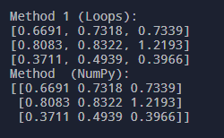

# Post-Flight Analysis Training

## Part 0: Getting Started

Post-flight analysis is a key part of the iterative engineering process. Looking back at the data collected during a test flight can provide insights into the forces experienced on the rocket, the general flight path, the specific timings of staging events, and more. The insights, in turn, allow other groups within our team to improve their designs to build a better rocket.

### 0.1: What is Python?

Python is one of the most widely-used programming languages in the computer engineering and computer science industry, and for good reason; it has a very simple syntax that beginners can read and understand, is very easy to develop and test code with, and has built-in support for many powerful packages that assist the development process greatly. It’s especially useful for post-flight data analysis, in which case Python is able to provide powerful data visualization tools (like graphs and charts), as well as interactive interfaces and automation services to make interacting and analyzing our data even easier. By taking advantage of these features of Python, post-flight data analysis can be made far simpler and more efficient.


#### Compiled vs. Interpreted Languages

Python is an interpreted programming language, just like Javascript, R, and MATLAB. “Interpreted” means that when you run your code, your program is evaluated and executed line by line, every single time you run the program. This isn’t always the case; certain programming languages, like C, C++, and Rust, are called compiled languages. Compiled languages are translated (or compiled) into a more computer-friendly format the first time they’re run, and this new version is used every time the program is run.

This is how a compiled language behaves, in general:


And similarly, this is how an interpreted language behaves.


Interpreted languages like Python are a little bit easier to do post-flight analysis with, since they don't need to be compiled (re-translated) every time they're run.
Python specifically is very easy to write with, because a lot of complicated processes are handled in the background and its syntax is generally simple to understand. Additionally,
Python is known for having a large existing collection of popular and effective numerical and scientific tools that you can use right away, in the form of packages and modules.

#### Packages and Modules

Using packages, you can incorporate Python code written by others into your own program. These packages, oftentimes, are downloaded off the internet to your machine and stored locally so your code can pull from them. Packages are simply groups of “modules,” where each module is a Python file with useful routines written into them that can be pulled into your main program. When you incorporate a module or a package into your program, they become “dependencies.” As the name implies, a Python program needs all of its dependencies at runtime in order to function correctly, or oftentimes, function at all. Sometimes modules include packages or modules within themselves; in this case, you still need to find and download these modules for your program to function. This means that dependencies can have dependencies as well!


#### Installing Packages (pip)

Pip is one of the most common tools for package management that comes built-in with Python. With one-line terminal commands, packages can be downloaded to your machine, meaning the only thing you need to do is import the code into your file. However, some projects may require certain packages while others require different packages; in this case, installing all the packages for every project you’ll work on is messy and a waste of resources.

A simple solution is Venv, a “**v**irtual **env**ironment” creator for Python that you install separately, which essentially allows you to create a separate space for different projects and sets of packages. This means multiple package and module installations won’t clutter up and pollute your build environment, whatever it may be for that project. Think of it like a real-life library; instead of looking for a book in every shelf in every room, you can sort a library by genre or author. Venv does the same thing; virtual environments are like bookshelves for your packages, so you and your programming environment have less to sort through.

By using Venv and pip together, you can accomplish most of your scientific computing tasks. Pip and Venv are great tools for managing python packages and basic environments. However, newer tools exist for package management that are better integrated with virtual environment managers, which also have more options for scientific tools to work with. This means a bigger, better library for you to work with. One of the best options for our work is Conda.

### 0.2: What is Conda?

Conda is a package management system similar to pip, but it offers additional features, including an environment management system. Unlike Pip, Conda must be installed externally. With Conda, users can install, run, and update software packages and dependencies just like with Pip. However, the major difference is that Conda includes an environment manager, making it easier and more efficient for users to create virtual environments for different projects. The environment management feature enhances the flexibility and usability of conda, allowing users to isolate project dependencies and manage multiple projects more effectively.

#### Managing Multiple Environments

As stated above Conda allows the user to create different virtual environments. A virtual environment is an isolated space where you can install and manage a specific set of packages and dependencies without affecting other projects on your system. Each environment has its directory, separate from the system's global environment, containing all the necessary files and libraries required for a particular project. This isolation helps prevent conflicts between different projects, allowing you to use different versions of packages and Python for each project. Environments are especially useful for managing dependencies and ensuring that your projects are reproducible and consistent across different systems. Conda allows you to switch between these different environments and install different versions of Python or packages in different environments efficiently and easily.

#### Controlling Dependencies and Conflicts

It's important to control the versions of dependencies for your project because different packages often rely on others, which can lead to compatibility issues. A good way to understand these relationships is through a dependency graph, where each node represents a package, and each edge represents a dependency. For example, if Package A depends on Package B, there will be a line from A to B.

Different packages need different versions of the same dependency, leading to conflicts. For instance, Package A might require version 1.2 of a library, while Package B needs version 2.0. Additionally, some packages or versions may become outdated and no longer maintained.

Conda helps manage these issues with a dependency resolver. This resolver analyzes the dependency graph and determines the best way to install, update, or remove packages without causing conflicts. Where you run a command to install or update a package, Conda ensures all dependencies are met and compatible versions are used, keeping your environment stable and consistent. If you would like to understand how the Conda solver works on a deeper level you can do some further reading [here](https://docs.conda.io/projects/conda/en/latest/dev-guide/deep-dives/solvers.html)


### 0.3: How do we use Python and Conda?

Python and Conda are used all the time for post-flight analysis. We use Python and Conda to automate tools. For example, we have developed a binary parser that would take flight log data in bytes and convert it into a .csv format using Python. This allowed us to retrieve data such as rocket position, acceleration, time, etc. This data then would be used in jupyter notebooks to make graphs. We would plot things such as acceleration vs time to notice possible errors in the hardware or even the program. These are a few examples of how we use Python and Conda but we are continuously looking for ways to develop our flight analysis to improve future rocket designs and builds.

## Part 1: Installing Conda

Install [Miniconda](https://docs.anaconda.com/miniconda/#quick-command-line-install). You can also follow the instructions below. Miniconda contains the "useful" parts of Anaconda that includes Conda (the actual dependency solver), Python, and a few essential packages. It's advantageous to install Miniconda instead of the full Anaconda because the installation file is smaller while still providing full functionality. You can still add any of the packages provided by Anaconda to your environments using Conda as needed.

When you go to type Conda in your terminal you shell tries to find a shell function named Conda or an executable file named Conda in your PATH directories. Therefore if your Conda has not been initalized properly it will fail to find a shell function named Conda and return Conda not found.

### Windows

    Open a Administrator window of Powershell Once the terminal is open, run the following commands to install and initialize Conda:
    
    ```Shell
    Invoke-WebRequest -Uri "https://repo.anaconda.com/miniconda/Miniconda3-latest-Windows-x86_64.exe" -OutFile "$env:TEMP\Miniconda3-latest-Windows-x86_64.exe"
    Start-Process "$env:TEMP\Miniconda3-latest-Windows-x86_64.exe" -ArgumentList '/S', '/InstallationType=JustMe', "/AddToPath=1", "/RegisterPython=1", "/D=$env:USERPROFILE\Miniconda3" -Wait
    & "$env:USERPROFILE\Miniconda3\Scripts\conda.exe" init powershell
    Remove-Item "$env:TEMP\Miniconda3-latest-Windows-x86_64.exe"
    ```
    
    This step is essential because it sets up Conda in your shell environment, enabling the shell to recognize Conda commands. When you run a Conda command, your shell searches for a function or executable named 'conda' in your PATH directories. If Conda hasn't been properly initialized, your shell won't find the command, leading to a 'conda not found' error.
    If you are more interested in the Conda init function you can do further reading [here](https://docs.conda.io/projects/conda/en/latest/dev-guide/deep-dives/activation.html)

### MacOS

    Open your terminal and run the following command to install and initialize Conda:

        ```Shell
        curl -LO https://repo.anaconda.com/miniconda/Miniconda3-latest-MacOSX-x86_64.sh
        chmod +x Miniconda3-latest-MacOSX-x86_64.sh
        bash ./Miniconda3-latest-MacOSX-x86_64.sh -b -p $HOME/miniconda
        $HOME/miniconda/bin/conda init --all
        rm Miniconda3-latest-MacOSX-x86_64.sh
        ```
    Conda init on MacOS works very similar to that of Windows. This function modifies the '.zshrc' (MacOS shell configuration file) and sets up the necessary environment variables and PATH settings so that the Conda command is recognized when you open a terminal. Refer to the Windows initialization if you want to do more reading on the Conda init function.

### Linux

Open your Linux terminal, and run the following commands. You can copy with ctrl+c, but make sure you paste with ctrl+shift+V.

    ```Shell
    mkdir -p ~/miniconda3  #creates folder for conda installer
    wget https://repo.anaconda.com/miniconda/Miniconda3-latest-Linux-x86_64.sh -O ~/miniconda3/miniconda.sh #Gets conda installer
    bash ~/miniconda3/miniconda.sh -b -u -p ~/miniconda3  #runs conda installer
    rm -rf ~/miniconda3/miniconda.sh #deletes conda installer
    ```

Regardless of your OS, you must **restart** your shell after installing and initializing conda.

### Verify Conda Installation

After installing and initializing Conda, locate the test scripts folder above and download the appropriate script for your operating system. Then for Windows open up the Powershell and for Linux/MacOS open up the terminal. Once in your terminal navigate to the directory where the script was downloaded using the 'cd' command. Once there, type the script's name to run it.

    ```Shell
    .\verify_conda_windows.ps1 #Windows
    ./verify_conda_macos.zsh #MacOS
    ./verify_conda_linux.sh #Linux
    ```

#### Resolving Permissions Issues

    If you encounter a permission denied error on Mac/Linux, it likely means that the script doesn't have the necessary execute permissions. This sort of permissions error will only occur on MacOS/Linux systems as Windows does not manage permissions in the same way (see below). To resolve this, you can grant execute permissions by using the following command:

    ```Shell
    chmod +x verify_conda_linux.sh #Linux
    chmod +x verify_conda_macos.zsh #MacOS
    ```
    This grants the script execute permission allowing you to run the program. If you would like to learn more about Linux/MacOS file permissions you can do more reading [here](https://www.redhat.com/sysadmin/linux-file-permissions-explained). 

    If you run into permission issues on Windows, it's because, by default, *Powershell* prohibits the execution of downloaded scripts, even if you, the user, have the authorization to execute that file. To fix this, you'll need to instruct Powershell to allow you to run scripts with the following options.

    To allow execution of a specific file **only** in the *current* Powershell session.
    
    ```Shell
        Unblock-File -Path .\test-scripts\verify_conda_windows.ps1
    ```

    To allow universal execution of scripts in all Powershell sessions. (Only do this if you frequently run scripts AND you know what your doing.)

    ```Shell
        Set-ExecutionPolicy -ExecutionPolicy Unrestricted
    ```

The script checks if Conda is installed and if it has been initialized. If Conda is both installed and initialized the terminal will output "Conda test OK." Otherwise, the script will tell you what is missing, and refer to the steps above if Conda is not initialized or installed.

Another way to check if Conda is set up correctly is to run the following below. This will call the Conda shell function and output the version of Conda your system currently has installed.

    ```Shell
    conda --version
    ```

The output should look something like the following.


Here are some useful Conda commands.

    ```Shell
    conda create --name <env_name> Python = 3.xx # Create a new Conda environment with Python 3.xx (Python subversion does not need to be specified)
    conda env list # List all the environments on your system
    conda list # List all packages and versions installed in the active environment
    conda install <package_name> # Install a package in the current environment
    conda activate env_name # Activate an environment
    conda deactivate # Switch to the base environment
    conda env remove --name <env_name> # Delete an environment and everything in it
    conda remove <package_name> # Uninstall package in environment
    ```

## Part 2a: Python exercise setup

First, we're going to get started with setting up your first Python project: a matrix multiplication program!
Open your terminal and proceed with the steps below:

First, we will set up a virtual environment that contains Python and the relevant packages before writing any code. Remember it is good practice to create a new environment for each project.

    ```Shell
    conda create --name pfa_training
    ```

Once our Conda environment has been created we must activate it allowing us to manage our environment and utilize any installed packages. A nice feature built into Conda is it will specify the current environment in parenthesis on the left hand side of your terminal.

    ```Shell
    conda activate pfa_training
    ```

Now check your python version to make sure it's installed and up to date.

    ```Shell
    python --version
    ```

Numpy is a popular python package that makes it a lot easier to work with arrays and matrices, including the complicated math that comes with them.
We can install it on our machine by using the Conda commands from above:

    ```Shell
    conda install numpy
    ```

Open your terminal, and run your first line of python code: Hello world!

    ```Shell
    python -c "print('hello world!')" #"-c" lets you pass a string (the text that comes next) as a python line to your terminal and run it.
    ```

Enter your RRPL directory within your Projects directory.

    ```Shell
    cd {PATH_TO_PROJECTS_FOLDER}\RRPL\  #"." is a symbol for the parent folder you're currently in.
    ```

Make a new folder called py_exercises.

    ```Shell
    mkdir py-exercises # mkdir = make directory
    ```

Enter the new folder you just made.

    ```Shell
    cd .\py-exercises\     #cd  = change directory
    ```

Create a new file called "ex1.py" like this if you're on Windows:

    ```Shell
    New-Item -ItemType File -Name "ex1.py" #A file that ends with .py is a python executable.
    ```

If you're on a unix system (Linux, or MacOS which is based on Linux):

    ```Shell
    nano ex1.py
    #follow with ctrl+o (save), and ctrl+x (exit).
    ```

If you don't have VSCode installed, go ahead and open the file in your notepad.

    ```Shell
    notepad.exe .\ex1.py

    #if on unix, run:

    nano ex1.py
    ```

    If you do have vscode installed, open it with vscode. (Hint: get VSCode.)
    
    ```Shell
    code .\ex1.py
    ```

## Part 2: Simple Python Exercise

Let's get started with writing your first lines of Python code!

You're going to write two short functions to multiply two matrices together and print out the result to your terminal.

1. First, go ahead and import the numpy package, with the alias np.

```Python
import numpy as np #from now on, you can refer to numpy as np in your program.
```

2. Declare two 3x3 matrices, and store them in the variables l1 and l2.
The matrices should store numbers between 0 and 1.

```Python
example = [[1, 2, 3],
          [8, 40, 2],
          [1, 9, 7]]
     
#This is an example of what a python matrix might look like. 

#A matrix is really just an array of arrays; that's exactly what 
#we're doing here. It's an array of three elements, where each element
# is an array of three elements itself!
```

3. We are going to store the product in a third matrix.
In order to do this, create a third 3x3 matrix, and fill it with zeroes.

In order to multiply these matrices, it helps to know the number of rows
and columns that each matrix has. Let's say we didn't know it was a 3x3
matrix; you could figure this out by using the built-in "len" command in python.

```Python
# Matrix Dimensions

numRows = len(matrix) #gets the number of rows in a matrix

numCols = len(matrix[0]) #gets the number of columns, since we indexed to specify a row.
```

4. Write a triple-nested for loop to multiply the matrices together.

The outermost layer should iterate
through the number of rows in l1, the next layer should iterate through the number of columns in l2,
and the final layer should iterate through the number of columns in l1, which should be the same as the number of columns in l2.

Within the innermost layer, store the multiplied result of the current row index of l1 (the index of the outermost layer)
and the current column index of l2 (the index of the second layer) in the corresponding row and column index of the third layer.

Essentially, what we're doing is a dot product; For each combination of row i from l1 and column j from l2, the innermost loop
calculates the product of the corresponding elements and adds it to the current position \[i\]\[j\] in the result matrix.

If you're having trouble visualizing this, take a look at the matrix multiplication graph below, and review how to write a for-loop in Python.
Remember, code is supposed to make computations easier, not harder!

Also take a look at this link that explains how matrix multiplication works in a little more detail.

<https://www.mathsisfun.com/algebra/matrix-multiplying.html>


```Python
for i in range(10):
    #This is what a for-loop looks like, for reference. You can write an action here to be repeated 10 times.

```

5. Print out your result matrix so you can see if it worked once you run your program.
You can use "print" and a for-loop to iterate through all the rows of the matrix and
print by row.

```Python
    for row in result:
    print(row)
```

The other, and most efficient (and easiest to type) method is using our NumPy package that we imported before.

1. First, store both arrays as numpy array variables. Here's an example:

```Python
newArray = np.array(exampleArray)
#we can use np instead of numpy, because we imported numpy as np at the top.
```

Storing arrays like this means we can use numpy's suite of functions with them.
For instance, numpy arrays can be multiplied by simply using the @ operator, instead
of manually writing out a multiplication algorithm.

2. Multiply both matrices using the @ operator, and store them in a new variable of your choice.
Then, print out the result.

```Python
array1@array2 #It should look something like this. You need to figure out what's missing!
```

That should make two methods of matrix multiplication. It's time to see if they worked!

Save your file with ctrl+s, and name your file ex1.py.

Then, re-open your terminal, and navigate back to your projects directory if you left it.

```Shell
cd {PATH_TO_PROJECTS_FOLDER}\RRPL\py-exercises
```

Then, write the following line to run your program, in either your computer's terminal or in VSCode terminal:

```Shell
python ex1.py
```

Your output should look like this:



That's a quick introduction to the basics of post-flight analysis: A lot of math, and a lot of python!

## Part 2b: Speed Comparison

The three methods of matrix multiplication done above are not only different in the way they're typed, but also in the time it takes
for python to compute the output. To see this, download an adjusted python script here, run it in your terminal, and read the output.
Use what you learned from the training to figure out how!


Note the difference in speed. What do you see? Which method was the fastest, and why do you think so?

## Part 3: Simple Jupyter Exercise

Jupyter is like a programming "notebook" that helps us with post-flight analysis, and it's a powerful tool that we use at RPL.

As mentioned before, interpreted languages are oftentimes better for quick testing since you don't need to compile the program every time they're run,
and simply running the file instead. Jupyter takes this a step further: instead of running the entire file every time, jupyter lets you run chunks of a
file by themselves, letting you do small-scale, quick, and most importantly, efficient computations and data analysis while you're writing code.
It's a huge asset for post-flight analysis, where minute changes to data representation are common.

Start by opening up your terminal and installing jupyter. Ensure you are still in the pfa_training conda environment.

```Shell
conda install jupyter
```

Now try doing the following steps without opening your file explorer!

1. Enter your RRPL/projects folder.

2. Create a new file with the ending .ipynb. This is the file extension for jupyter notebooks (**i**nteractive **py**thon **n**ote**b**ook).

3. Open the new file in VSCode.

3. Or, if you prefer, you can create and launch the jupyter notebook using your terminal:

```Shell
jupyter notebook
```

One key thing to remember is jupyter will use the environment in when launched. For example if you launch jupyter notebook in the base environment and try to run a numpy command it will not be found as it is not installed in the base environment.

At this point, the file should be open, and there should be a dark box in the center of your screen:


### Programming in Jupyter

This "dark box" is called a "cell." Code that we write in these cells can be executed on their own, kind of like putting breakpoints in regular code,
but even more efficient and intuitive.

1. In that cell, import your numpy library with the alias "np", and import the library "matplotlib.pyplot" as plt.
If you don't have the latter library, download it just as you did with numpy (conda install matplotlib).

2. Create a new cell. VSCode makes this easy for you; find the "+Code" button in the top left of your interface.
 If you're in the online jupyter interface, it'll be the "plus" button in the top-left corner.


3. Matplotlib is a plotting library that lets you create graphs based on data input super intuitively. Before you can use matplotlib, though, there is
an extra line of code you need to write before Jupyter will print plots below the cell you're working in, or "in-line".

```Python
%matplotlib inline
```

4. Make another cell. In this cell, generate an array of numbers from 0 to 100, with 500 evenly spaced samples between them. You can do this easily with
numpy's "linspace" function. For example:

```Python
array = np.linspace(start, end, numSamples)
#"Start" is the start value of the array, "End" is the end value, and "numSamples" is the literal number of elements you want in the array.
```

Or, you can reference Numpy's documentation for a better explanation. <https://numpy.org/doc/stable/reference/generated/numpy.linspace.html>
(You'll be using documentation a lot in pfa!)

5. Now that you understand how to make an array with linspace, we're going to take it a step further. Make a new cell.

    1. First, in this new cell, make another array with linspace, and use a for-loop instead of three arguments. In this array, store the number 5 five hundred times.

    ```Python
    array = np.array([5 for _ in range(500)]) 
    ```

    2. Now, plot the new array you just made against the first array you made using matplotlibs. The command might look something like this:

    ```Python
    plt.plot(arrayX, arrayY)
    ```

    Array X will be your X axis, and ArrayY will be your Y axis.

   3. Go ahead and title your plot using matplotlibs:

    ```Python
    plt.title('Pick a name!')
    ```

6. Now that you've made it this far, run all of your cells, one by one, in descending order. Notice how changes slowly take effect. Once you're done,
change the name of the plot, and re-run the final cell. Notice how you don't need to re-run the entire program to make changes; this is the importance of jupyter!

Your plot should look something like this:


7. Another great feature of Matplotlib is its ability to overlay multiple plots on top of each other. This is particularly useful when you want to compare different datasets that share the same axes, as it allows you to see how the data interacts or differs in a single view.

In this example, we'll demonstrate this by first using np.random.rand to generate a set of uniform random points. Then, we'll use np.random.normal to generate a set of points with Gaussian noise. For our Guassian noise, we will specify two parameters one being 'scale' which specifies the standard deviation of the normal distribution and the second 'size' which determines the number of random values to generate. By overlaying these two plots, you can easily compare the distribution of uniform random data against the Gaussian noise, all within the same graph.

```Python
plt.plot(x, np.random.rand(500)*2-1) # Uniform Noise
plt.plot(x, np.random.normal(scale=0.5,size=500)) # Gaussian Noise
plt.title('Plot 2: Uniform vs. Gaussian Noise')
```

Your plot should look something like this:


8. Now let's try plotting a function.

```Python
y2 = -1*pow((x-50)/10, 2)+25 # What does this look like as a formula?
plt.plot(x, y2)
plt.title('Plot 3: Parabolic Trajectory')
```

Your plot should look something like this:


9. Another cool feature is you can manipulate a function once it has been defined already. For example in the code snippet below we will translate the parabola up and down defined in the variable y3.

```Python
y3 = -1*pow((x-50)/10, 2)+25
plt.plot(x, y3)
plt.plot(x, y3+1)
plt.plot(x, y3-1)
plt.title('Plot 4: Vertical Translations')
```

Your plot should look something like this:


10. Function manipulation is not only limited to integer addition and subtraction. Let's try adding some Gaussian and uniform noise to our parabolas.

```Python
y4 = pow((x-50)/10, 2)
plt.plot(x, y4)
plt.plot(x, y4+3+np.random.normal(scale=0.75,size=500)) # Translate and add gaussian noise
plt.plot(x, y4-4+3*np.random.rand(500)) # Translate and add uniform noise
plt.title('Plot 5')
```

Your plot should look something like this:


11. Lastly, you can utilize in-built functions in numpy such as sin for your plots. For the last plot will we create a noisy sin function.

```Python
y3 = np.sin(x/np.pi) + x/20
y3 += np.random.normal(scale=0.5,size=500)

plt.plot(x, y3)
plt.title('Plot 6: Noisy Composite Function')
```

Your plot should look like this:


That's it! Congratulations and welcome to PFA!
